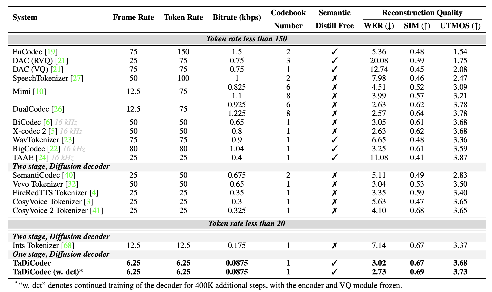
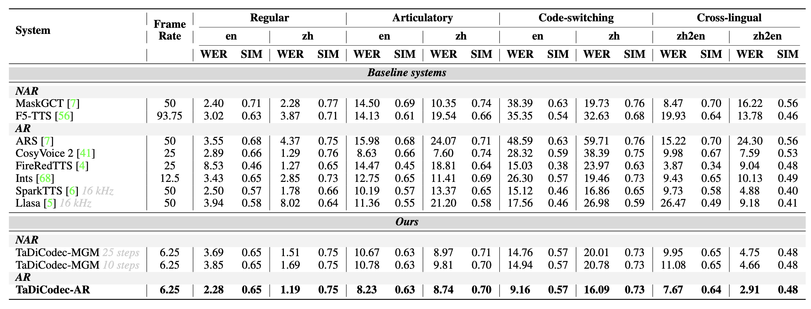

<div align="center">

# 🎵 Diffusion-Speech-Tokenizer 🚀


**🔬 Official PyTorch Implementation of TaDiCodec**

<!-- *A series of works on diffusion-based speech tokenizers* -->

<!-- TODO: replace the paper link to the arXiv link -->
📄 **Paper**: [TaDiCodec: Text-aware Diffusion Speech Tokenizer for Speech Language Modeling](https://hecheng0625.github.io/assets/pdf/Arxiv_TaDiCodec.pdf)

[](https://github.com/HeCheng0625/Diffusion-Speech-Tokenizer)
[](https://hecheng0625.github.io/assets/pdf/Arxiv_TaDiCodec.pdf)
[](https://tadicodec.github.io/)
[](https://www.python.org/)
[](https://pytorch.org/)
[](https://huggingface.co/amphion/TaDiCodec)

<!-- [](https://modelscope.cn/models/amphion/TaDiCodec) -->


</div>

---

## 📋 Overview

This repository is designed to provide comprehensive implementations for our series of diffusion-based speech tokenizer research works. Currently, it primarily features [**TaDiCodec**](https://hecheng0625.github.io/assets/pdf/Arxiv_TaDiCodec.pdf), with plans to include additional in-progress works in the future. Specifically, the repository includes:

- 🧠 A simple PyTorch implementation of the TaDiCodec tokenizer
- 🎯 Token-based zero-shot TTS models based on TaDiCodec:
  - 🤖 Autoregressive based TTS models
  - 🌊 [Masked diffusion (a.k.a. Masked Genrative Model (MGM)](https://arxiv.org/abs/2409.00750) based TTS models
- 🏋️ Training scripts for tokenizer and TTS models
- 🤗 [Hugging Face](https://huggingface.co/amphion/tadicodec) and 🔮 [ModelScope](https://modelscope.cn/models/amphion/tadicodec) (to be updated) for easy access to pre-trained models

Short Intro on [**TaDiCodec: Text-aware Diffusion Speech Tokenizer for Speech Language Modeling**](https://hecheng0625.github.io/assets/pdf/Arxiv_TaDiCodec.pdf):

We introduce the **T**ext-**a**ware **Di**ffusion Transformer Speech **Codec** (TaDiCodec), a novel approach to speech tokenization that employs end-to-end optimization for quantization and reconstruction through a **diffusion autoencoder**, while integrating **text guidance** into the diffusion decoder to enhance reconstruction quality and achieve **optimal compression**. TaDiCodec achieves an extremely low frame rate of **6.25 Hz** and a corresponding bitrate of **0.0875 kbps** with a single-layer codebook for **24 kHz speech**, while maintaining superior performance on critical speech generation evaluation metrics such as Word Error Rate (WER), speaker similarity (SIM), and speech quality (UTMOS).

<!-- Notably, TaDiCodec employs a single-stage, end-to-end training paradigm, and obviating the need for auxiliary pre-trained models. -->

---

## 📢 News & Updates

<div align="center">

### 🔥 Latest Updates 🔥

</div>

<!-- - **🎉 [2025-08-11]** TaDiCodec is accepted by NeurIPS 2025! -->
- **🚀 [2025-08-25]** We release the offical implementation of TaDiCodec and the TTS models based on TaDiCodec.
- **🔥 [2025-08-25]** TaDiCodec paper released! Check out our [arXiv preprint](https://hecheng0625.github.io/assets/pdf/Arxiv_TaDiCodec.pdf)

---

## 🚧 Development Roadmap & TODO List

<div align="center">

**🔥 Current Status: Active Development 🔥**

*This project is under active development. Check back frequently for updates!*

</div>

### 🎯 Core TaDiCodec Implementation
- [x] 🏗️ **Repository Structure Setup**
- [x] 📝 **Documentation Framework**
- [x] 🧠 **TaDiCodec Model Architecture**
  - [x] NAR Llama-style transformers for encoder and decoder architectures
  - [x] text-aware flow matching (diffusion) decoder
  - [x] vocoder for mel2wav
- [ ] ⚡ **Inference Pipeline**
  - [x] Basic inference pipeline
  - [ ] Add auto-ASR for text input

### 🎓 Training Infrastructure
- [ ] 🏋️ **TaDiCodec Training Scripts**
- [ ] 💾 **Dataset and Dataloader**

### 🎤 Text-to-Speech Models
- [ ] 🤖 **Autoregressive Models**
  - [x] Model architecture
  - [x] Pre-training models loading and inference
  - [ ] Training scripts
- [ ] 🌊 **Masked Diffusion Models**
  - [x] Model architecture
  - [x] Pre-training models loading and inference
  - [ ] Training scripts

### 📊 Evaluation
- [ ] Add evaluation scripts

### 🪐 Future Works
- [ ] 🛸 **Diffusion-based Speech Tokenizer without text conditioning**

---


## 🤗 Pre-trained Models

### 📦 Model Zoo - Ready to Use!

*Download our pre-trained models for instant inference*

### 🎵 TaDiCodec

| Model | 🤗 Hugging Face | 👷 Status |
|:-----:|:---------------:|:------:|
| **🚀 TaDiCodec** | [](https://huggingface.co/amphion/TaDiCodec) | ✅ |
| **🚀 TaDiCodec-old** | [](https://huggingface.co/amphion/TaDiCodec-old) | 🚧 |

*Note: TaDiCodec-old is the old version of TaDiCodec, the TaDiCodec-TTS-AR-Phi-3.5-4B is based on TaDiCodec-old.*

### 🎤 TTS Models

| Model | Type | LLM | 🤗 Hugging Face | 👷 Status |
|:-----:|:----:|:---:|:---------------:|:-------------:|
| **🤖 TaDiCodec-TTS-AR-Qwen2.5-0.5B** | AR | Qwen2.5-0.5B-Instruct | [](https://huggingface.co/amphion/TaDiCodec-TTS-AR-Qwen2.5-0.5B) | ✅ |
| **🤖 TaDiCodec-TTS-AR-Qwen2.5-3B** | AR | Qwen2.5-3B-Instruct | [](https://huggingface.co/amphion/TaDiCodec-TTS-AR-Qwen2.5-3B) | ✅ |
| **🤖 TaDiCodec-TTS-AR-Phi-3.5-4B** | AR | Phi-3.5-mini-instruct | [](https://huggingface.co/amphion/TaDiCodec-TTS-AR-Phi-3.5-4B) | 🚧 |
| **🌊 TaDiCodec-TTS-MGM** | MGM | - | [](https://huggingface.co/amphion/TaDiCodec-TTS-MGM) | ✅ |

- [ ] ModelScope will be updated soon.

### 🔧 Quick Model Usage

```python
# 🤗 Load from Hugging Face
from models.tts.tadicodec.inference_tadicodec import TaDiCodecPipline
from models.tts.llm_tts.inference_llm_tts import TTSInferencePipeline
from models.tts.llm_tts.inference_mgm_tts import MGMInferencePipeline

# Load TaDiCodec tokenizer, it will automatically download the model from Hugging Face for the first time
tokenizer = TaDiCodecPipline.from_pretrained("amphion/TaDiCodec")

# Load AR TTS model, it will automatically download the model from Hugging Face for the first time  
tts_model = TTSInferencePipeline.from_pretrained("amphion/TaDiCodec-TTS-AR-Qwen2.5-3B")

# Load MGM TTS model, it will automatically download the model from Hugging Face for the first time
tts_model = MGMInferencePipeline.from_pretrained("amphion/TaDiCodec-TTS-MGM")
```

---

## 🚀 Quick Start

### Installation

```bash
# Clone the repository
git clone https://github.com/HeCheng0625/Diffusion-Speech-Tokenizer.git
cd Diffusion-Speech-Tokenizer

# Install dependencies
bash env.sh
```

### Basic Usage

**Please refer to the [use_examples](./use_examples) folder for more detailed usage examples.**


#### Speech Tokenization and Reconstruction

```python
# Example: Using TaDiCodec for speech tokenization
import torch
import soundfile as sf
from models.tts.tadicodec.inference_tadicodec import TaDiCodecPipline

device = torch.device("cuda" if torch.cuda.is_available() else "cpu")
pipe = TaDiCodecPipline.from_pretrained(ckpt_dir="./ckpt/TaDiCodec", device=device)

# Text of the prompt audio
prompt_text = "In short, we embarked on a mission to make America great again, for all Americans."
# Text of the target audio
target_text = "But to those who knew her well, it was a symbol of her unwavering determination and spirit."

# Input audio path of the prompt audio
prompt_speech_path = "./use_examples/test_audio/trump_0.wav"
# Input audio path of the target audio
speech_path = "./use_examples/test_audio/trump_1.wav"

rec_audio = pipe(
    text=target_text,
    speech_path=speech_path,
    prompt_text=prompt_text,
    prompt_speech_path=prompt_speech_path
)
sf.write("./use_examples/test_audio/trump_rec.wav", rec_audio, 24000)
```

#### Zero-shot TTS with TaDiCodec

```python
import torch
import soundfile as sf
from models.tts.llm_tts.inference_llm_tts import TTSInferencePipeline
# from models.tts.llm_tts.inference_mgm_tts import MGMInferencePipeline

device = torch.device("cuda" if torch.cuda.is_available() else "cpu")

# Create AR TTS pipeline
pipeline = TTSInferencePipeline.from_pretrained(
    tadicodec_path="./ckpt/TaDiCodec",
    llm_path="./ckpt/TaDiCodec-TTS-AR-Qwen2.5-3B",
    device=device,
)

# Inference on single sample, you can also use the MGM TTS pipeline
audio = pipeline(
    text="但是 to those who 知道 her well, it was a 标志 of her unwavering 决心 and spirit.",   # code-switching cases are supported
    prompt_text="In short, we embarked on a mission to make America great again, for all Americans.",
    prompt_speech_path="./use_examples/test_audio/trump_0.wav",
)

sf.write("./use_examples/test_audio/lm_tts_output.wav", audio, 24000)
```

---

## 📊 Performance

### 🏆 TaDiCodec Performance Metrics



### 🎭 TTS Model Performance Metrics



---

## 🛠️ Training Examples

### Training TaDiCodec

- [ ] To be updated

### Training TTS Models

- [ ] To be updated

---

## 📚 Citation

If you find this repository useful, please cite our paper:

TaDiCodec:
```bibtex
@article{tadicodec2025,
  title={TaDiCodec: Text-aware Diffusion Speech Tokenizer for Speech Language Modeling},
  author={Yuancheng Wang, Dekun Chen, Xueyao Zhang, Junan Zhang, Jiaqi Li, Zhizheng Wu},
  journal={arXiv preprint},
  year={2025},
  url={https://hecheng0625.github.io/assets/pdf/Arxiv_TaDiCodec.pdf}
}
```

Amphion:
```bibtex
@inproceedings{amphion,
    author={Xueyao Zhang and Liumeng Xue and Yicheng Gu and Yuancheng Wang and Jiaqi Li and Haorui He and Chaoren Wang and Ting Song and Xi Chen and Zihao Fang and Haopeng Chen and Junan Zhang and Tze Ying Tang and Lexiao Zou and Mingxuan Wang and Jun Han and Kai Chen and Haizhou Li and Zhizheng Wu},
    title={Amphion: An Open-Source Audio, Music and Speech Generation Toolkit},
    booktitle={{IEEE} Spoken Language Technology Workshop, {SLT} 2024},
    year={2024}
}
```

MaskGCT:
```bibtex
@inproceedings{wang2024maskgct,
  author={Wang, Yuancheng and Zhan, Haoyue and Liu, Liwei and Zeng, Ruihong and Guo, Haotian and Zheng, Jiachen and Zhang, Qiang and Zhang, Xueyao and Zhang, Shunsi and Wu, Zhizheng},
  title={MaskGCT: Zero-Shot Text-to-Speech with Masked Generative Codec Transformer},
  booktitle    = {{ICLR}},
  publisher    = {OpenReview.net},
  year         = {2025}
}
```

---

## 📄 License

TaDiCodec is licensed under the Apache 2.0.

## 🙏 Acknowledgments

- **MGM-based TTS** is built upon [MaskGCT](https://github.com/open-mmlab/Amphion/tree/main/models/tts/maskgct).

- **Vocos vocoder** is built upon [Vocos](https://github.com/gemelo-ai/vocos).

- **NAR Llama-style transformers** is built upon [transformers](https://github.com/huggingface/transformers).

- **(Binary Spherical Quantization) BSQ** is built upon [vector-quantize-pytorch](https://github.com/lucidrains/vector-quantize-pytorch) and [bsq-vit](https://github.com/zhaoyue-zephyrus/bsq-vit).

- **Training codebase** is built upon [Amphion](https://github.com/open-mmlab/Amphion) and [accelerate](https://github.com/huggingface/accelerate).

---

<div align="center">

## 🌟 Star History

[](https://star-history.com/#HeCheng0625/Diffusion-Speech-Tokenizer&Date)

---

### 💫 Made with ❤️ for the Speech AI Community

**🚀 If you find this project helpful, please consider giving it a ⭐!**

<div style="margin: 20px 0;">
  
  
  
</div>

*Building the future of speech synthesis, one token at a time* 🎯

---

<sub>🔔 **Stay Updated**: Watch this repository for the latest developments in diffusion-based speech tokenization!</sub>

</div>
